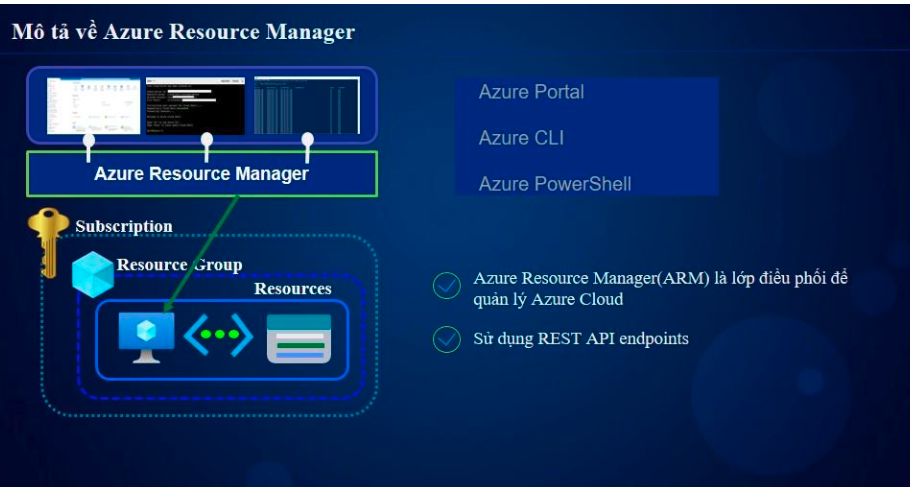

# 🌐 Chương 1: Quản trị Azure (Azure Administration)

## 📌 Giới Thiệu
** Chương naỳ chúng ta sẽ cùng làm quen tổng quan về cách quản trị trên Azure 

ARM là cách mình tương tác với Azure Cloud để quản trị tất cả các tài nguyên trên Azure
- Azure portal: Tương tác chính với UI Azure 
- Azure CLI : môi trường dòng lệnh được cung cấp trên Cloud Azure 
- Azure PowerShell: 
---