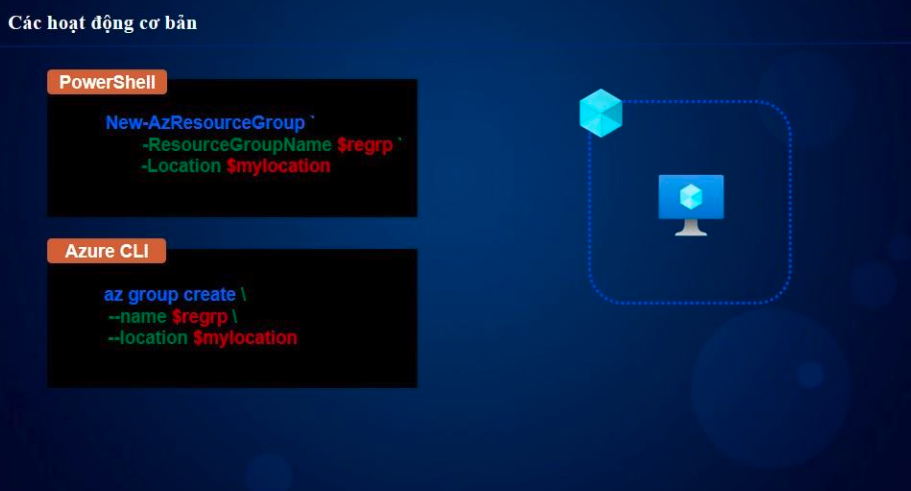
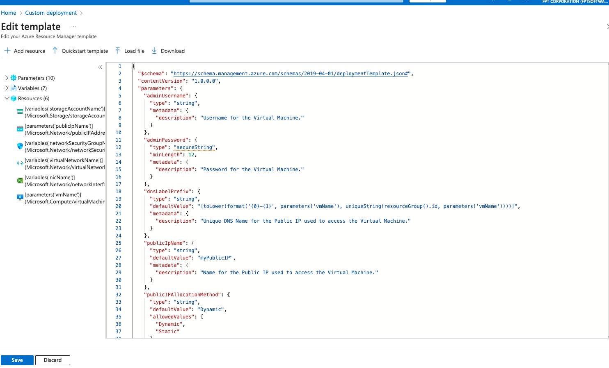
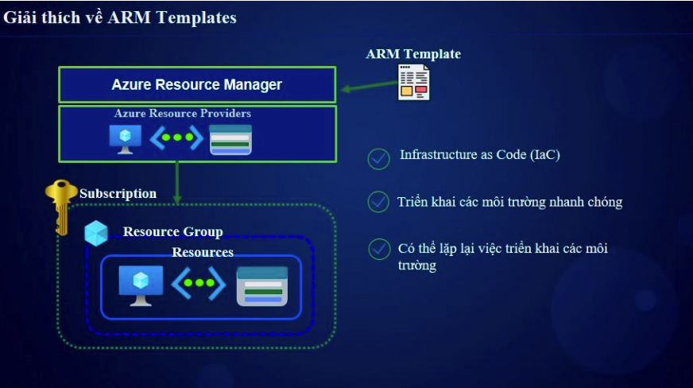
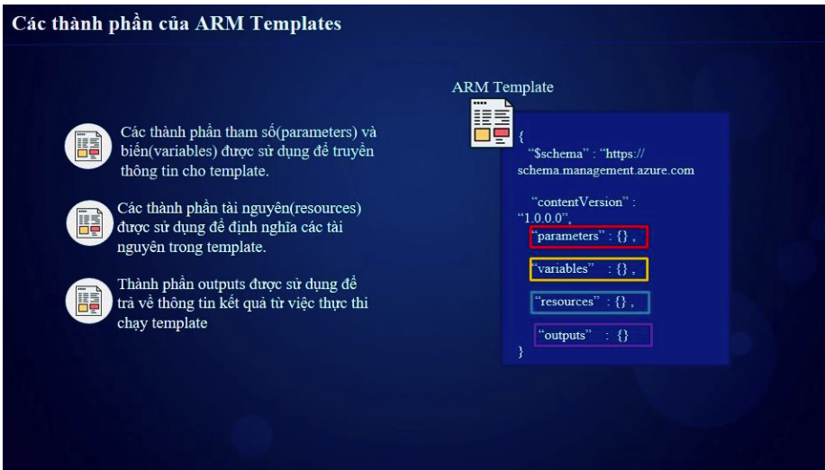

# 🌐 Chương 1: Quản trị Azure (Azure Administration)

## 📌 1. Giới Thiệu
** Chương naỳ chúng ta sẽ cùng làm quen tổng quan về cách quản trị trên Azure 

ARM là cách mình tương tác với Azure Cloud để quản trị tất cả các tài nguyên trên Azure
- Azure portal: Tương tác chính với UI Azure 
- Cloud Shell: Được tích hợp ngay trên UI portal để test nhanh các lệnh (powershell hoặc bash script)

- Azure CLI :  Tiện ích dòng lệnh để quản lý tài nguyên, Có thể tạo và quản lý mà không cần vào Azure portal
- Azure PowerShell: Là tập lệnh ghép nhắn (cmdles) , tạo và không cần vào Azure Portal luôn  

=> Thường sử dụng Azure CLI và Azure Powershell để có thể tạo các scripts tự động hoá trong Azure 
---

## 2. Thực Hành 
- Tương tác với Azure Cloudshell 
- Thực hiện lệnh Azure CLI để tạo tài nguyên gì đó (VM,..) (lệnh được cung cấp file commands đính kèm trong chương)
- Tạo tài nguyên bằng cách Azure template (ARM Template) 

## 3. Output
Hiểu được cách để quản lý các tài nguyên của trên Azure thông qua Azure portal ,Cloudshell, Azure CLI , Azure powershell 

## 4 Tài liệu bổ sung ARM template 

Các thành phần chính trong ARM templates 

