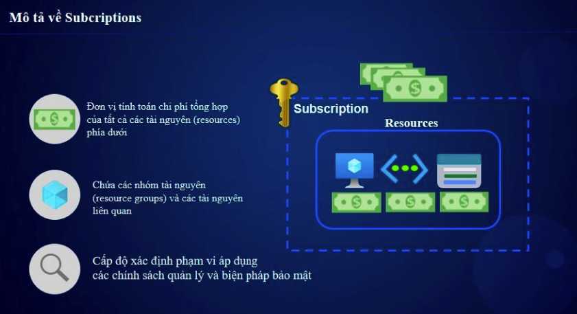
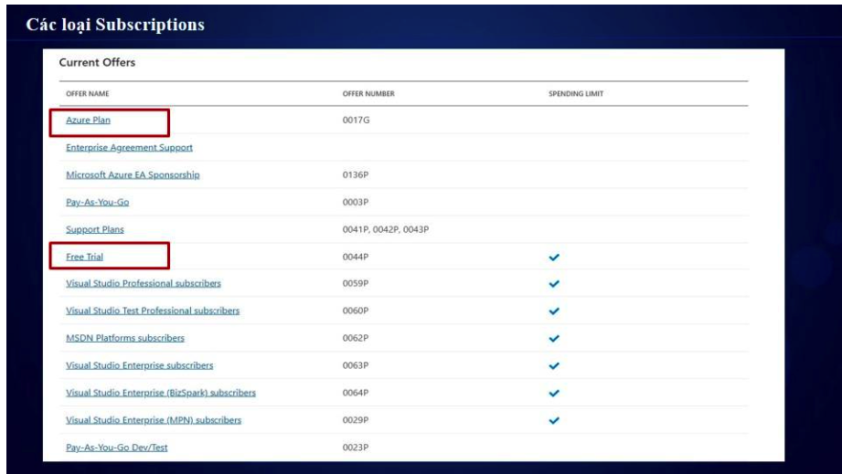
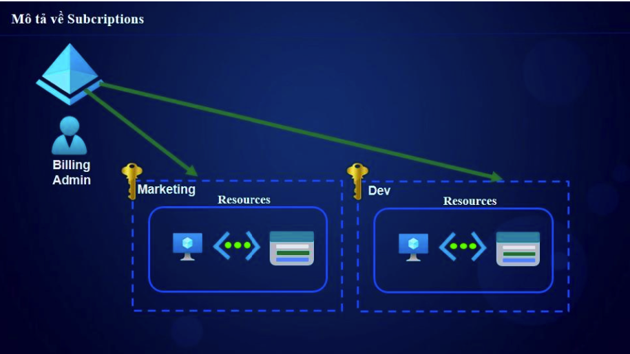
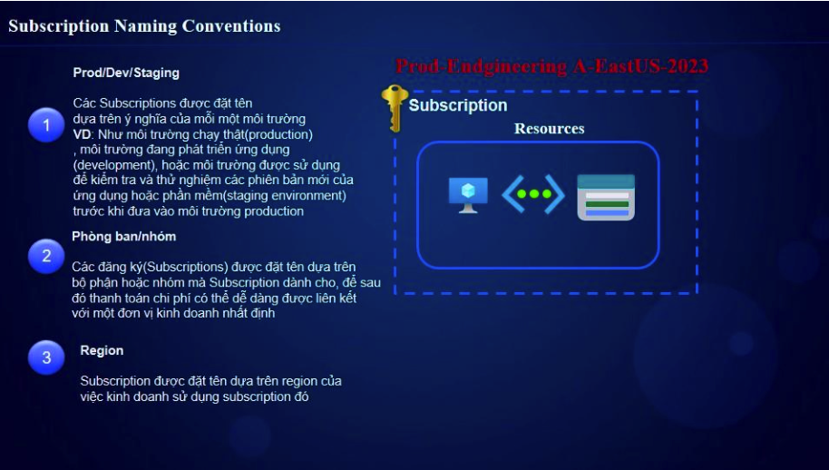

# Azure Subscription

## 1. Giới thiệu
**Subscription** trong Azure là một đơn vị tổ chức giúp quản lý tài nguyên, chi phí và quyền truy cập. Mỗi subscription có một ID duy nhất và liên kết với một hoặc nhiều tài khoản Azure.

## 2. Các thành phần chính
- **Subscription ID**: Mã định danh duy nhất của subscription.
- **Billing Account**: Liên kết với phương thức thanh toán.
- **Resource Groups**: Chia tài nguyên thành các nhóm để quản lý dễ dàng.  

- **Access Control (RBAC)**: Quản lý quyền truy cập bằng Azure Role-Based Access Control.

## 3. Loại Subscription
Azure cung cấp nhiều loại subscription khác nhau:  

- **Free Trial**: Dành cho người dùng mới, có 200$ tín dụng trong 30 ngày.
- **Pay-As-You-Go**: Thanh toán theo mức sử dụng thực tế.
- **Enterprise Agreement (EA)**: Dành cho doanh nghiệp lớn.
- **Microsoft Partner Network (MPN)**: Dành cho đối tác của Microsoft.
- **Azure for Students**: Cung cấp miễn phí tín dụng cho sinh viên.

## 4. Quản lý Subscription
### 4.1 Tạo Subscription
Bạn có thể tạo một subscription mới thông qua:
- **Azure Portal**: `Home` > `Subscriptions` > `+Add`
- **Azure CLI**:
  ```sh
  az account subscription create --name "MySubscription" 
- **Azure Powershell**:
  ```sh
  New-AzSubscription -SubscriptionName "MySubscription"

### 4.2 Kiểm tra Subscription hiện có
- **Azure CLI**:
  ```sh
  az account list --output table

- **Azure Powershell**:
  ```sh
  Get-AzSubscription


### 4.3.Tenant và Subcriptions


Chúng ta có thể phân quyền để truy cập vào subcriptions


## 5. Naming 
