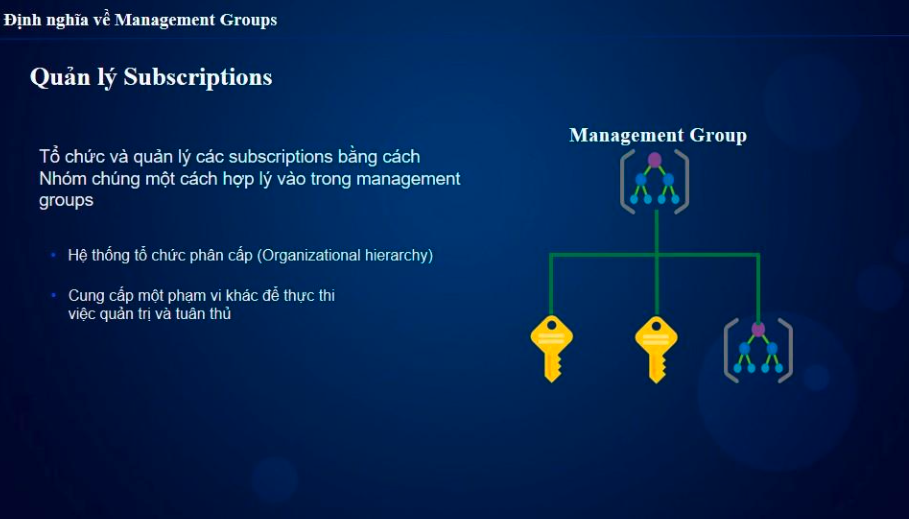
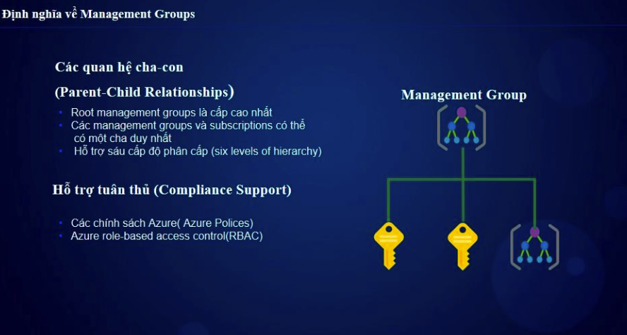
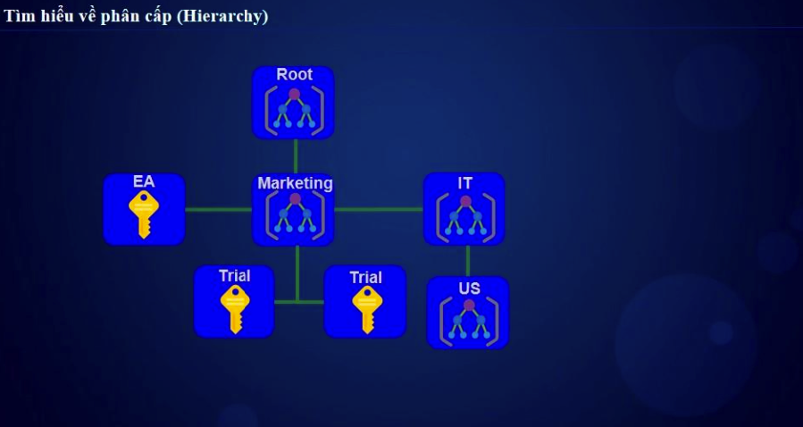
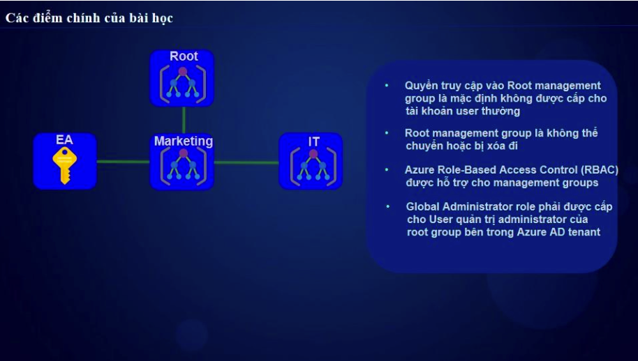

# Azure Management Groups

## 1. Giới thiệu
**Azure Management Groups** là một cơ chế giúp tổ chức và quản lý nhiều subscription trong Azure một cách hiệu quả. Nó cho phép áp dụng các chính sách và kiểm soát truy cập trên nhiều subscription cùng lúc.

## 2. Kiến Trúc Quản Lý
Cấu trúc phân cấp trong Azure từ cao xuống thấp:  
Management Groups > Subscriptions > Resource Groups > Resources  
- **Management Groups**: Quản lý nhiều subscription.
- **Subscriptions**: Chứa các tài nguyên Azure.
- **Resource Groups**: Nhóm các tài nguyên liên quan.
- **Resources**: Các dịch vụ và tài nguyên như VM, Storage, v.v.



## 3. Tính Năng Chính
### 3.1. Tổ Chức Subscription
- Nhóm các subscription theo phòng ban, dự án hoặc yêu cầu quản lý.
- Mỗi subscription chỉ thuộc một **Management Group**.

### 3.2. Kế Thừa Chính Sách (Inheritance)
- **Azure Policy** và **Role-Based Access Control (RBAC)** được áp dụng từ Management Group xuống subscription, resource groups và resources.

### 3.3. Quản Lý Quyền Truy Cập
- Gán quyền truy cập (RBAC) cho **Management Group** để áp dụng trên toàn bộ subscription bên trong.

## 4. Cấu Trúc Phân Cấp


- Một **Tenant (Azure AD Directory)** có **một Management Group gốc (Root)**.
- Một Management Group có thể chứa:
  - Nhiều **Subscription**.
  - Nhiều **Management Groups** con (tối đa 6 cấp độ).
  
Ví dụ về cấu trúc:
Root Management Group 
│ ├── Finance-Group 
│ ├── Subscription-A 
│ ├── Subscription-B 
│ ├── IT-Group 
│ ├── Dev-Subscription 
│ ├── Prod-Subscription 
│ └── HR-Group 
├── Subscription-C 
├── Subscription-D


## 5. Quản Lý Management Groups
### 5.1. Tạo Management Group
- **Azure Portal**:
  1. Vào **Management Groups**.
  2. Nhấn **+ Create**.
  3. Nhập **Tên nhóm** và **ID**.
  4. Chọn **Create**.

- **Azure CLI**:
  ```sh
  az account management-group create --name "MyManagementGroup"

- **Azure powerShell**:
  ```sh
  New-AzManagementGroup -GroupName "MyManagementGroup"


### 5.2 Thêm Subcription vào Management Group 
```sh
az account management-group subscription add --name "MyManagementGroup" --subscription "Subscription-ID"  
```

### 5.3 Xem Danh Sách Management Groups
```sh
az account management-group list --output table
```

## 6. Áp dụng chinhs sách (Azure Policy)
- Tạo Azure Policy và áp dụng ở mức Management Group để kiểm soát tất cả subscription bên dưới.  


Ví dụ: Chặn tạo tài nguyên ngoài vùng được chỉ định.

## 7. RBAC và Bảo Mật
- Gán quyền truy cập theo cấp bậc (ví dụ: Owner, Contributor, Reader).
- Quyền gán ở Management Group sẽ kế thừa xuống Subscription và tài nguyên bên dưới.

