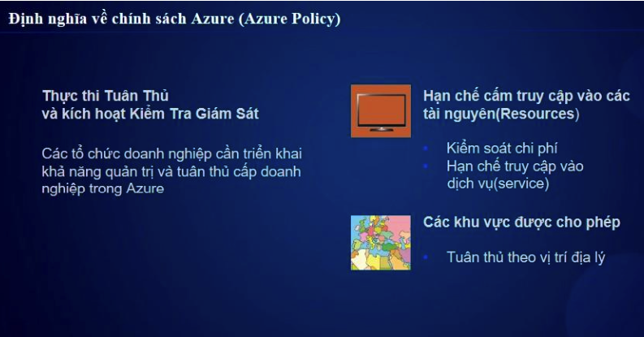

# Azure Policy

## 1. Giới thiệu  
**Azure Policy** là một dịch vụ giúp tổ chức thực thi các quy tắc và kiểm soát việc triển khai tài nguyên trong Azure nhằm đảm bảo tuân thủ các tiêu chuẩn nội bộ và quy định của doanh nghiệp.

***Tóm tắt***

- Cần triển khai khả năng quản trị và tuân thru cấp doanh nghiệp trong Azure 
- Hạn chế cấp truy cập tài nguyên (Giảm chi phí, tránh lãng phí tài nguyên )
- Tuân thủ theo khách hàng (theo khu vực được cho phép,..)



## 2. Tính Năng Chính  
- **Kiểm soát & thực thi**: Áp dụng quy tắc trên các tài nguyên Azure.
- **Tự động sửa lỗi**: Một số chính sách có thể tự động sửa lỗi khi vi phạm.
- **Theo dõi tuân thủ**: Xem trạng thái tuân thủ của các tài nguyên trong Azure Policy Compliance Dashboard.

## 3. Thành Phần Cốt Lõi  
- **Policy Definition**: Định nghĩa quy tắc cần kiểm tra.
- **Policy Assignment**: Áp dụng policy lên một phạm vi (Management Group, Subscription, Resource Group).
- **Policy Parameters**: Giúp tái sử dụng policy với các giá trị khác nhau.
- **Initiative**: Nhóm nhiều policy lại để quản lý dễ dàng hơn.
- **Compliance State**: Theo dõi mức độ tuân thủ của tài nguyên.

## 4. Ví Dụ Policy  
### 4.1. Chặn Tạo VM Loại Không Được Phép  
```json
{
  "mode": "All",
  "policyRule": {
    "if": {
      "field": "Microsoft.Compute/virtualMachines/sku.name",
      "notIn": ["Standard_DS3_v2", "Standard_DS2_v2"]
    },
    "then": {
      "effect": "deny"
    }
  }
}  
```

### 4.2. Bật Tự Động Mã Hóa Storage Account
```json
{
  "mode": "All",
  "policyRule": {
    "if": {
      "field": "Microsoft.Storage/storageAccounts/encryption.keySource",
      "notEquals": "Microsoft.Storage"
    },
    "then": {
      "effect": "modify",
      "details": {
        "operations": [
          {
            "field": "Microsoft.Storage/storageAccounts/encryption.keySource",
            "value": "Microsoft.Storage"
          }
        ]
      }
    }
  }
}
```
## 5. Cách Áp Dụng Azure Policy
### 5.1. Sử Dụng Azure Portal
1. Vào Azure Policy trong Azure Portal.
2. Chọn Assignments → Assign Policy.
3. Chọn phạm vi (Scope) như Subscription hoặc Resource Group.
4. Chọn Policy Definition và áp dụng.

### 5.2. Sử Dụng Azure CLI
```sh
az policy assignment create --name "DenyVMPolicy" --policy "/providers/Microsoft.Authorization/policyDefinitions/DenyVM" --scope "/subscriptions/{subscription-id}"
```
### 5.3. Sử Dụng Azure PowerShell
```sh
New-AzPolicyAssignment -Name "DenyVMPolicy" -PolicyDefinition "/providers/Microsoft.Authorization/policyDefinitions/DenyVM" -Scope "/subscriptions/{subscription-id}"
```
