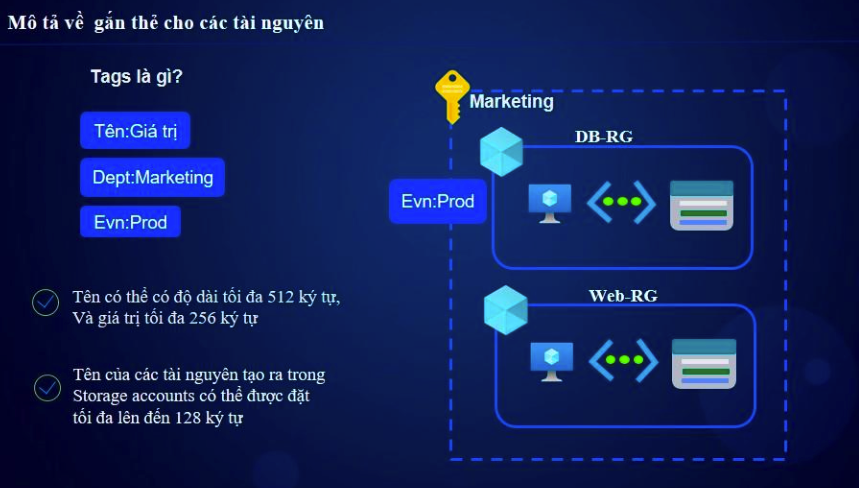

# Azure Tags

## 1. Giới Thiệu  
**Azure Tags** là một cách để gán **cặp khóa-giá trị (key-value pairs)** vào tài nguyên Azure nhằm giúp tổ chức, phân loại và quản lý tài nguyên hiệu quả hơn.



## 2. Lợi Ích Của Tags  
- **Quản lý tài nguyên tốt hơn**: Nhóm tài nguyên theo dự án, bộ phận, môi trường, v.v.  
- **Theo dõi chi phí**: Gán tags để phân bổ chi phí theo phòng ban hoặc khách hàng.  
- **Tự động hóa**: Dễ dàng lọc tài nguyên dựa trên tags để áp dụng chính sách hoặc tự động hóa.  

## 3. Cấu Trúc Tags  
Mỗi tag bao gồm hai thành phần:  
```plaintext
Key: Environment
Value: Production  
```

## 4. Cách Áp Dụng Tags
### 4.1. Sử Dụng Azure Portal
- Truy cập Azure Portal → Chọn tài nguyên.
- Vào tab Tags → Nhập Key và Value → Lưu lại.

### 4.2. SỬ dụng Azure CLI
```sh
az tag create --resource-id "/subscriptions/{sub-id}/resourceGroups/{rg-name}/providers/Microsoft.Compute/virtualMachines/{vm-name}" --tags Environment=Production Owner="IT Team"
```

### 4.3. Sử Dụng Azure PowerShell
```sh
Set-AzResource -ResourceId "/subscriptions/{sub-id}/resourceGroups/{rg-name}/providers/Microsoft.Compute/virtualMachines/{vm-name}" -Tag @{Environment="Production"; Owner="IT Team"} -Force
```

## 5. Giới Hạn Của Tags
- Mỗi tài nguyên có thể có tối đa 50 tags.
- Key tối đa 512 ký tự, Value tối đa 256 ký tự.
- Một số tài nguyên (ví dụ: Storage Account) không hỗ trợ tags trực tiếp.

## 6. Một số cách đánh tags đồng bộ 

Azure Tags không được kế thừa từ Resource Group.

📌 Giải thích:
Khi bạn gán tags cho một Resource Group, các tài nguyên bên trong không tự động nhận tags đó.
Nếu muốn tất cả tài nguyên trong Resource Group có cùng tags, bạn phải gán tags riêng lẻ cho từng tài nguyên.

Do tính không kế thừa của tags
Để đânh tags đồng bộ cho cá tài nguyên b

### 6.1 Viết file sh và chạy file đó   
vi run_tags.sh
```sh
# Đặt tên resource group và các tag cần thêm
RESOURCE_GROUP="rg-ABC-dev"
TAGS="Module=XXY"

# Lấy danh sách tất cả các tài nguyên trong resource group
resources=$(az resource list --resource-group $RESOURCE_GROUP --query "[].id" -o tsv)

# Thêm tag cho từng tài nguyên
for resource in $resources; do
    az resource tag --ids $resource --tags $TAGS
done

```


### 6.2 Azure CLI
```sh
az group update --name denso-hackathon --tags CreatedBy=NAME ProjectName=PROJECT Module=MODULE Environment=DEV
foreach ($resourceId in az resource list --resource-group denso-hackathon --query "[].id" -o tsv) {
    az resource tag --ids $resourceId --tags CreatedBy=NAME ProjectName=PROJECT Module=MODULE Environment=DEV
}
```