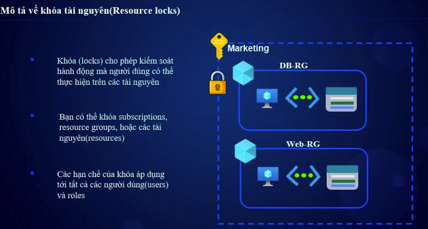
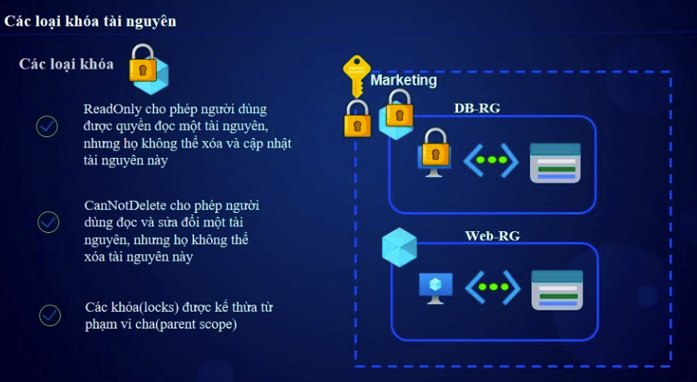

# Azure Resource Lock & Resource Move

## 1. Azure Resource Lock 🔒  

### 1.1. Giới Thiệu  
**Azure Resource Lock** giúp bảo vệ tài nguyên khỏi bị **xóa hoặc thay đổi ngoài ý muốn** bằng cách đặt **các khóa (lock)** trên Resource Group hoặc tài nguyên cụ thể.



### 1.2. Các Loại Lock  
| Loại Lock     | Mô tả |
|--------------|-------------------------------|
| **CanNotDelete** | Ngăn không cho xóa tài nguyên, nhưng vẫn có thể chỉnh sửa. |
| **ReadOnly** | Chỉ cho phép đọc, không thể xóa hoặc chỉnh sửa tài nguyên. |


### 1.3. Cách Đặt Lock  
#### 🔹 Dùng Azure Portal  
1. Vào **Azure Portal** → Chọn **Resource** hoặc **Resource Group**.  
2. Chuyển đến **Locks** → **+ Add**.  
3. Chọn **Loại Lock** (**ReadOnly** hoặc **CanNotDelete**) → **Lưu lại**.  

#### 🔹 Dùng Azure CLI  
```sh
az lock create --name "PreventDeletion" --resource-group "MyResourceGroup" --lock-type CanNotDelete
```
#### 🔹 Dùng Azure Powershell
```sh
New-AzResourceLock -LockName "PreventDeletion" -ResourceGroupName "MyResourceGroup" -LockLevel CanNotDelete
```
### 1.4. Gỡ Bỏ Lock
```sh
az lock delete --name "PreventDeletion" --resource-group "MyResourceGroup"
```

## 2. Di Chuyển Tài Nguyên (Resource Move) 🔄
### 2.1. Giới Thiệu
Azure cho phép di chuyển tài nguyên giữa:  
✅ Resource Groups  
✅ Subscriptions

Tuy nhiên, không phải tất cả tài nguyên đều hỗ trợ di chuyển.

### 2.2. Các Điều Kiện Khi Di Chuyển
- Tài nguyên phải hỗ trợ di chuyển (Danh sách tài nguyên hỗ trợ).
- Không có Resource Lock trên tài nguyên hoặc Resource Group.
- Không có hoạt động đang chạy trên tài nguyên.
### 2.3. Cách Di Chuyển
🔹 Dùng Azure Portal
1. Chọn Resource Group hoặc tài nguyên muốn di chuyển.
2. Chọn Move → Move to another resource group hoặc Move to another subscription.
3. Chọn đích đến và xác nhận di chuyển.


### 2.4. Những Tài Nguyên Không Thể Di Chuyển
- Azure Active Directory (AAD)
- Tài nguyên trong Availability Set hoặc Managed Disk
- Một số tài nguyên có liên kết với Public IP, Load Balancer
### 2.5. Giải Pháp Khi Không Thể Di Chuyển
- Sao chép dữ liệu, tạo tài nguyên mới và cấu hình lại.
- Sử dụng Azure Site Recovery để di chuyển VM.
