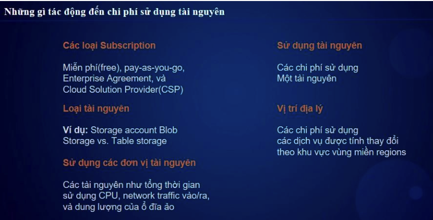
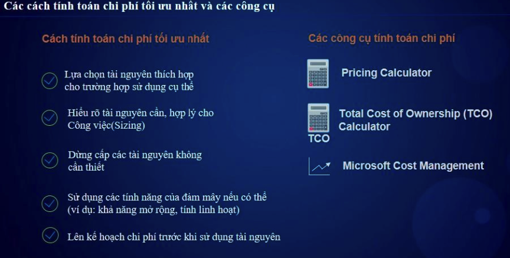

# 📊 Quản Lý Chi Phí Trên Azure  

## 1. Giới Thiệu  
Quản lý chi phí trong Azure giúp kiểm soát ngân sách, tối ưu tài nguyên và tránh lãng phí. Azure cung cấp nhiều công cụ để theo dõi, phân tích và ước tính chi phí.  

---

## 2. Các Công Cụ Quản Lý Chi Phí  

### 2.1. Azure Cost Management + Billing  
🔹 **Chức năng:**  
- Xem báo cáo chi phí theo **subscription, resource group, service**.  
- Thiết lập **Budget Alerts** để nhận thông báo khi vượt ngưỡng chi tiêu.  
- Tích hợp với **Power BI** để phân tích chi phí chi tiết.  

🔹 **Cách Truy Cập:**  
- **Azure Portal** → **Cost Management + Billing**  

---

### 2.2. Azure Pricing Calculator 🧮  
🔹 **Chức năng:**  
- **Ước tính chi phí** trước khi triển khai tài nguyên.  
- Xây dựng cấu hình tài nguyên và xem giá chi tiết.  
- Hỗ trợ các mô hình giá: **Pay-as-you-go, Reserved Instances**.  

🔹 **Truy Cập:**  
🔗 [Azure Pricing Calculator](https://azure.microsoft.com/en-us/pricing/calculator/)  

---

### 2.3. Azure Total Cost of Ownership (TCO) Calculator  
🔹 **Chức năng:**  
- So sánh chi phí giữa **on-premises vs Azure**.  
- Ước tính tiết kiệm khi di chuyển lên cloud.  
- Dùng để lập kế hoạch tài chính dài hạn.  

🔹 **Truy Cập:**  
🔗 [Azure TCO Calculator](https://azure.microsoft.com/en-us/pricing/tco/)  

---

### 2.4. Azure Advisor - Cost Optimization  
🔹 **Chức năng:**  
- Đưa ra **gợi ý tối ưu chi phí** dựa trên mức sử dụng tài nguyên.  
- Xác định **tài nguyên không sử dụng** hoặc có thể giảm kích thước (right-sizing).  
- Đề xuất **Reserved Instances** để tiết kiệm chi phí.  

🔹 **Truy Cập:**  
- **Azure Portal** → **Azure Advisor** → **Cost Optimization**  

---

## 3. Chiến Lược Tối Ưu Chi Phí  

✅ **Sử dụng Reserved Instances (RI)**: Giảm đến **72%** so với Pay-as-you-go nếu cam kết sử dụng 1-3 năm.  

✅ **Autoscaling & Shutdown Scheduler**: Tắt VM ngoài giờ làm việc để tiết kiệm chi phí.  

✅ **Bật Azure Hybrid Benefit**: Dùng Windows Server & SQL Server bản quyền có sẵn để tiết kiệm đến **85%**.  

✅ **Dùng Spot VM**: Chạy workload không quan trọng với giá thấp hơn **90%** so với VM tiêu chuẩn.  

✅ **Thiết lập Budget & Cost Alerts**: Định mức chi tiêu và nhận thông báo khi vượt ngân sách.  

---

## 4. Kết Luận  
- Azure cung cấp nhiều công cụ giúp **ước tính, giám sát và tối ưu chi phí**.  
- Sử dụng **Azure Cost Management**, **Pricing Calculator**, **TCO Calculator**, và **Azure Advisor** để kiểm soát ngân sách hiệu quả.  
- Áp dụng các chiến lược **Reserved Instances, Autoscaling, Hybrid Benefit** để giảm thiểu chi phí cloud.  

🚀 **Quản lý chi phí tốt giúp doanh nghiệp tiết kiệm & tối ưu hóa tài nguyên trên Azure!**  
