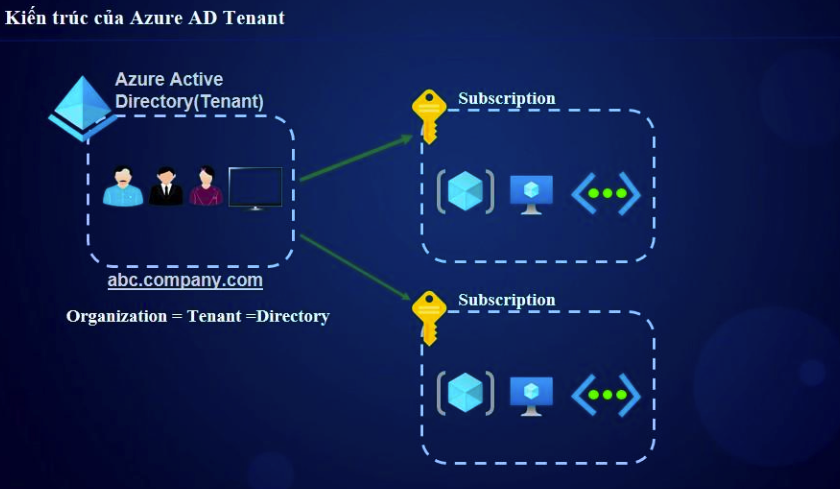

# 🏢 Kiến Thức Quan Trọng Về Tenants Trong Azure  

## 1. Tenants Là Gì?  
**Azure Tenant** là một **phiên bản Azure Active Directory (Azure AD)** dành riêng cho một tổ chức. Mỗi Tenant chứa **người dùng, nhóm, ứng dụng và chính sách bảo mật**.  

---

## 2. Các Thành Phần Chính Của Azure Tenant  

| Thành phần | Mô tả |
|------------|--------|
| **Azure AD Tenant** | Mỗi Tenant tương ứng với một Azure AD riêng biệt. |
| **Users & Groups** | Quản lý danh tính người dùng và nhóm trong Tenant. |
| **Subscriptions** | Một Tenant có thể chứa nhiều Azure Subscriptions. |
| **Directory ID (Tenant ID)** | Mã định danh duy nhất của Tenant. |
| **Custom Domains** | Tenant có thể sử dụng **tên miền tùy chỉnh** thay vì `onmicrosoft.com`. |
| **External Identities (B2B, B2C)** | Hỗ trợ đăng nhập cho người dùng bên ngoài. |
| **Conditional Access & Security Policies** | Áp dụng chính sách bảo mật cho Tenant. |

---

## 3. Các Khái Niệm Quan Trọng Cần Biết  

### 3.1. **Tenant vs Subscription**  
✅ **Tenant:** Quản lý danh tính và bảo mật (Azure AD).  
✅ **Subscription:** Quản lý tài nguyên và chi phí trong Azure.  
✅ **Một Tenant có thể chứa nhiều Subscriptions** nhưng **một Subscription chỉ thuộc về một Tenant**.  

### 3.2. **Tenant ID & Directory ID**  
- Tenant có một **ID duy nhất** (GUID).  
- Dùng để **xác thực & cấp quyền** trong Azure.  
- Có thể tìm thấy trong **Azure Portal → Azure Active Directory → Overview**.  

### 3.3. **User & Group Management**  
- **User Types:**  
  - **Member:** Người dùng nội bộ của Tenant.  
  - **Guest:** Người dùng bên ngoài (B2B).  
- **Groups:** Tạo nhóm để phân quyền RBAC và Azure AD Groups.  

### 3.4. **Custom Domains & Tenant Branding**  
- **Thêm domain tùy chỉnh** (VD: `company.com` thay vì `company.onmicrosoft.com`).  
- **Cấu hình Tenant Branding** để tùy chỉnh giao diện đăng nhập.  

### 3.5. **External Identities (B2B & B2C)**  
✅ **Azure AD B2B (Business to Business):** Cho phép cộng tác với đối tác bên ngoài.  
✅ **Azure AD B2C (Business to Customer):** Dùng cho ứng dụng khách hàng (CIAM).  

### 3.6. **Security & Compliance**  
- **Conditional Access:** Áp dụng chính sách truy cập có điều kiện (MFA, vị trí, thiết bị).  
- **Azure AD Identity Protection:** Phát hiện đăng nhập đáng ngờ.  
- **Privileged Identity Management (PIM):** Quản lý tài khoản có quyền cao.  

---