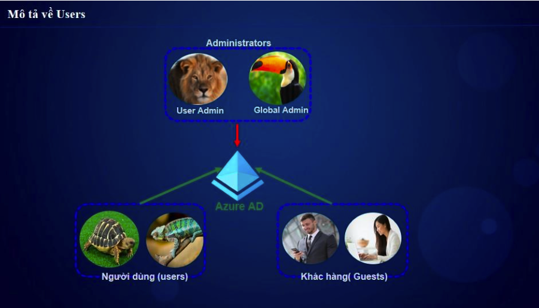
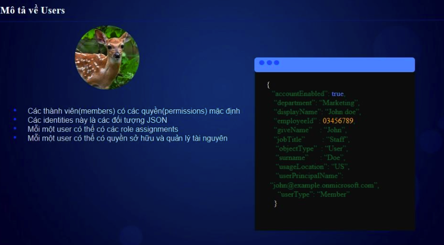
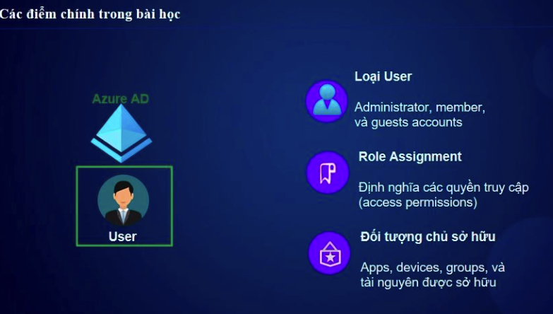

# 👤 Tạo & Quản Lý User, Group Trong Azure AD  

## 1. Quản Lý User Trong Azure AD  

### 1.1. **Loại User Trong Azure AD**  
| Loại User | Mô tả |
|------------|--------|
| **Member** | Người dùng nội bộ thuộc Tenant. |
| **Guest** | Người dùng bên ngoài (B2B Collaboration). |

Mô tả user thoong qua json

### 1.2. **Tạo User Mới**  
📌 **Azure Portal → Azure AD → Users → New User**  
✅ Nhập thông tin: **Tên, User Principal Name (UPN), Role**.  
✅ **Chọn loại user:** Member / Guest.  
✅ Cấu hình mật khẩu & chính sách đăng nhập.  

### 1.3. **Quản Lý User**  
✅ **Gán Role & RBAC:** Phân quyền theo vai trò (Owner, Contributor, Reader).  
✅ **Cấu hình MFA:** Bật xác thực đa yếu tố (Multi-Factor Authentication).  
✅ **Reset Password:** Đặt lại mật khẩu nếu user quên.  
✅ **Block / Delete User:** Vô hiệu hóa hoặc xóa tài khoản không còn sử dụng.  

---

## 2. Quản Lý Group Trong Azure AD  

### 2.1. **Loại Group Trong Azure AD**  
| Loại Group | Mô tả |
|------------|--------|
| **Security Group** | Dùng để quản lý quyền truy cập tài nguyên (RBAC). |
| **Microsoft 365 Group** | Dùng trong Microsoft Teams, Outlook, SharePoint. |
| **Dynamic Group** | Thành viên được thêm tự động dựa trên rule. |

### 2.2. **Tạo Group Mới**  
📌 **Azure Portal → Azure AD → Groups → New Group**  
✅ **Chọn loại Group:** Security / Microsoft 365.  
✅ **Gán Owner:** Quản trị viên nhóm.  
✅ **Thêm thành viên:** Chọn User / Service Principal.  
✅ **Chọn Membership Type:**  
- **Assigned:** Thêm user thủ công.  
- **Dynamic User / Device:** Thêm user tự động theo điều kiện.  

### 2.3. **Quản Lý Group**  
✅ **Gán quyền RBAC cho Group:** Giúp phân quyền nhanh chóng.  
✅ **Sử dụng Group-based Licensing:** Gán license Office 365, Azure AD P1/P2 tự động.  
✅ **Xóa hoặc chuyển quyền Group khi cần thiết.**  

-----
