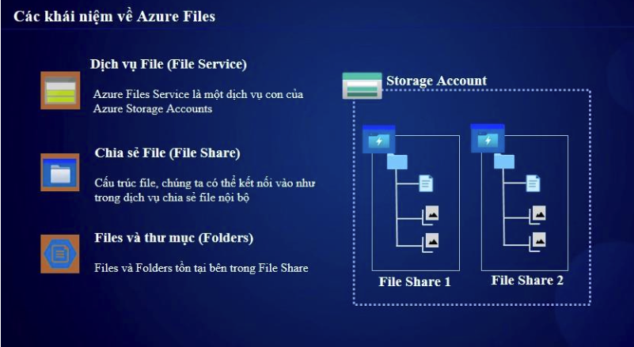
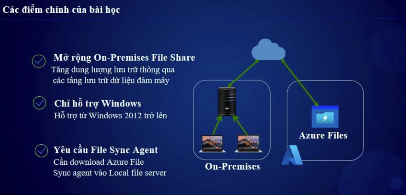

# **Azure Files - Tóm tắt kiến thức chính (AZ-104)**  

## **1. Giới thiệu về Azure Files**  
Azure Files là một dịch vụ lưu trữ file trên nền tảng đám mây, cho phép tạo **file shares** có thể gắn kết (mount) từ Windows, Linux, macOS hoặc on-premises bằng giao thức **SMB (Server Message Block) hoặc NFS (Network File System)**.


---

## **2. Tính năng chính của Azure Files**  
✅ **Hỗ trợ giao thức:**  
   - **SMB 3.0/2.1**: Dùng cho Windows, Linux, macOS, Azure Virtual Machines.  
   - **NFS v4.1**: Hỗ trợ môi trường Linux.  

✅ **Dễ dàng mở rộng:**  
   - Dung lượng lên đến **100 TiB** trên mỗi storage account.  
   - Có thể gắn kết như một **ổ đĩa mạng**.  

✅ **Azure File Sync:**  
   - Đồng bộ dữ liệu giữa Azure Files và on-premises.  
   - Hỗ trợ nhiều địa điểm (multi-site sync).  

✅ **Bảo mật mạnh mẽ:**  
   - Hỗ trợ **Azure AD Authentication**, **Private Endpoint**, **RBAC (Role-Based Access Control)**.  
   - Mã hóa dữ liệu **AES-256** khi lưu trữ (at-rest) và truyền tải (in-transit).  

---

## **3. Các loại Storage Tier trong Azure Files**  
Azure Files hỗ trợ nhiều cấp lưu trữ để tối ưu chi phí và hiệu suất:  

| **Storage Tier**   | **Mô tả** | **Use Case** |
|------------------|-----------|-------------|
| **Premium**   | SSD-based, hiệu suất cao, độ trễ thấp | Cần tốc độ cao, database, app latency-sensitive |
| **Transaction Optimized** | HDD-based, hiệu suất tốt, chi phí trung bình | Chia sẻ file dùng chung, ứng dụng doanh nghiệp |
| **Hot** | HDD-based, lưu trữ tệp truy cập thường xuyên | File logs, dữ liệu phân tích |
| **Cool** | HDD-based, lưu trữ dữ liệu truy cập ít | Backup, lưu trữ lâu dài |

---

## **4. Cách triển khai Azure Files**  
### **A. Tạo Azure File Share**  
1. Tạo **Storage Account** (`Standard` hoặc `Premium`).  
2. Chọn tab **File Shares** và tạo File Share mới.  
3. Chọn **SMB hoặc NFS**, đặt dung lượng giới hạn.  

### **B. Kết nối Azure Files từ Windows/Linux**  
#### **Windows (SMB)**  
```powershell
net use Z: \\<storageaccount>.file.core.windows.net\<fileshare> /user:Azure\<storageaccount> <storagekey>
```

## 5. Azure File Sync - Đồng bộ với On-premises
Azure File Sync giúp đồng bộ dữ liệu giữa on-premises và Azure Files.

Cách triển khai
1. Tạo Azure File Sync Service trong Azure.
2. Cài đặt Azure File Sync Agent trên Windows Server.
3. Đăng ký Windows Server vào Azure File Sync.
4. Cấu hình Cloud Endpoint và Server Endpoint.

