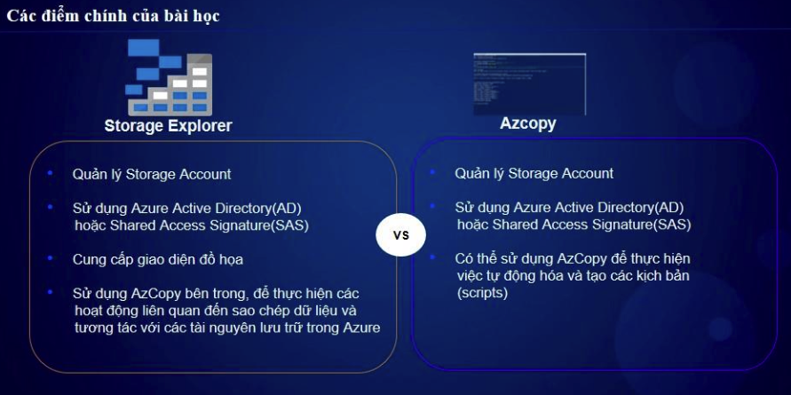

# **Azure Storage Explorer & AzCopy - Tóm tắt AZ-104**  

## **1. Azure Storage Explorer**  

### **a. Tổng quan**  
✅ **Azure Storage Explorer** là một công cụ GUI miễn phí giúp quản lý **Azure Storage Account** một cách trực quan.  
✅ Hỗ trợ quản lý **Blob Storage, File Shares, Tables, Queues** trên máy tính cá nhân.  
✅ Hỗ trợ **kết nối bằng SAS Token, Storage Account Key, Azure AD Authentication**.  

### **b. Tính năng chính**  
- Truy cập và quản lý **Blob Containers, File Shares, Queues, Tables**.  
- **Upload, download, copy, move, delete dữ liệu** dễ dàng.  
- Hỗ trợ **Shared Access Signatures (SAS)** để chia sẻ dữ liệu an toàn.  
- Xem **metadata, properties** của file trong Storage Account.  
- Kết nối với **Azure, Local Emulator hoặc On-Premises Storage**.  

### **c. Cách tải và cài đặt Azure Storage Explorer**  
🔗 **Download Storage Explorer**: [https://azure.microsoft.com/en-us/products/storage/storage-explorer](https://azure.microsoft.com/en-us/products/storage/storage-explorer)  

### **d. Cách kết nối với Storage Account**  
1. Mở **Azure Storage Explorer**.  
2. Nhấn **Add Account** > Chọn cách kết nối:  
   - **Azure Subscription** (Đăng nhập tài khoản Azure).  
   - **Connection String** (Dùng khi không có tài khoản).  
   - **SAS Token** (Dùng để truy cập tạm thời).  
   - **Storage Account Name & Key** (Truy cập trực tiếp).  
3. Xác nhận kết nối, dữ liệu sẽ hiển thị trong giao diện.  

### **e. Thao tác cơ bản trong Azure Storage Explorer**  
- **Upload file lên Blob Storage**  
  - Chọn Storage Account > Chọn **Blob Containers** > Nhấn **Upload**.  
- **Download file từ Azure Storage**  
  - Click chuột phải vào file > **Download**.  
- **Tạo Shared Access Signature (SAS)**  
  - Chọn **Blob Container** > Click chuột phải > **Get Shared Access Signature**.  

### **f. Lợi ích của Azure Storage Explorer**  
✅ **Dễ sử dụng** với giao diện GUI trực quan.  
✅ **Hỗ trợ nhiều phương thức kết nối** (Azure AD, SAS, Storage Key).  
✅ **Hỗ trợ quản lý tất cả loại Storage** trên một ứng dụng duy nhất.  
✅ **Miễn phí và chạy được trên Windows, macOS, Linux**.  

---

## **2. AzCopy**  

### **a. Tổng quan**  
✅ **AzCopy** là công cụ dòng lệnh (CLI) giúp **sao chép dữ liệu nhanh chóng** vào/ra khỏi Azure Storage.  
✅ Hỗ trợ **Blob Storage, File Shares, Table Storage**.  
✅ Hỗ trợ **SAS Token, Storage Account Key, Azure AD Authentication**.  
✅ Tăng tốc upload/download dữ liệu lớn bằng **parallelization**.  



### **b. Cách tải AzCopy**  
🔗 **Download AzCopy**: [https://aka.ms/downloadazcopy](https://aka.ms/downloadazcopy)  

Sau khi tải, giải nén và thêm AzCopy vào **PATH** để có thể sử dụng từ terminal/cmd.  

### **c. Các lệnh AzCopy quan trọng**  

🚀 **Kiểm tra phiên bản AzCopy**  
```bash
azcopy --version
```