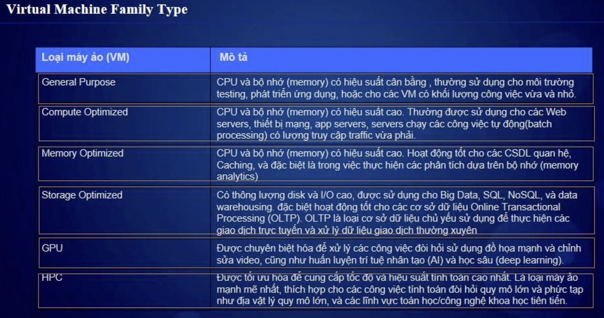

# 🚀 Kiến Trúc Azure Virtual Machines & Loại VM Type Family  

## 1️⃣ Kiến Trúc Azure Virtual Machines  

### 🔹 Thành Phần Cấu Thành Một Azure VM 
 
| **Thành Phần** | **Mô Tả** |
|--------------|----------|
| **Compute (VM Size)** | CPU, RAM phù hợp với workload |
| **OS Disk & Data Disk** | Lưu hệ điều hành & dữ liệu |
| **Temporary Disk** | Ổ đĩa lưu trữ tạm thời, bị xóa khi restart |
| **Networking** | Private IP, Public IP, NSG, Load Balancer |
| **Availability Options** | Availability Sets, Availability Zones |
| **Scaling** | Manual Scaling, VM Scale Sets |
| **Security** | Azure Bastion, Just-in-Time Access, Disk Encryption |
| **Monitoring** | Azure Monitor, Log Analytics, Alerts |
| **Backup & Disaster Recovery** | Azure Backup, Site Recovery |

---

## 2️⃣ Các Loại **Azure VM Type Family**  

Azure chia VM thành **nhiều loại dựa trên mục đích sử dụng**, mỗi loại có **series riêng**.

### ✅ **1. General Purpose (Dùng Chung)**
📌 **Cân bằng giữa CPU & RAM, phù hợp với ứng dụng web, database nhỏ**  
- **D-Series**: Phổ biến nhất, hiệu suất cao  
- **B-Series**: Burstable VM, dùng ít CPU thì tiết kiệm chi phí  
- **DC-Series**: Hỗ trợ **Confidential Computing** (bảo mật cao)  

🔹 **Ví dụ:** Web App, API Server, Application Server  

---

### ✅ **2. Compute Optimized (Tối Ưu CPU)**
📌 **Dành cho workload cần nhiều CPU hơn RAM (High CPU)**  
- **F-Series**: Xử lý mạnh mẽ, cao hơn D-Series  
- **FX-Series**: Hiệu suất cao hơn F-Series  

🔹 **Ví dụ:** Game server, AI Inference, ứng dụng cần nhiều CPU  

---

### ✅ **3. Memory Optimized (Tối Ưu RAM)**
📌 **Dành cho ứng dụng tiêu thụ RAM lớn (Database, Big Data, SAP)**  
- **E-Series**: RAM nhiều hơn D-Series (~2x RAM so với CPU)  
- **M-Series**: Chuyên dùng cho SAP HANA, database lớn  
- **G-Series**: Kết hợp nhiều RAM + SSD tốc độ cao  

🔹 **Ví dụ:** SQL Server, NoSQL Database, SAP HANA, Data Analytics  

---

### ✅ **4. Storage Optimized (Tối Ưu Lưu Trữ)**
📌 **Tối ưu cho ứng dụng yêu cầu IOPS cao, latency thấp**  
- **L-Series**: Chuyên xử lý **NoSQL, Data Warehouse, Big Data**  
- **HPC Cache VMs**: Hỗ trợ **high-speed cache storage**  

🔹 **Ví dụ:** Cassandra, MongoDB, Elasticsearch, Big Data Processing  

---

### ✅ **5. GPU VMs (Graphics & AI/ML)**
📌 **Chạy các tác vụ AI, Machine Learning, Render Video, Deep Learning**  
- **NV-Series**: GPU NVIDIA dành cho **Graphics & Gaming**  
- **NC-Series**: Tối ưu AI/ML với **NVIDIA Tesla GPUs**  
- **ND-Series**: **AI Training, Deep Learning, CUDA Compute**  

🔹 **Ví dụ:** AI Training, 3D Rendering, Video Processing, Simulation  

---

### ✅ **6. High Performance Computing (HPC)**
📌 **Dành cho các tác vụ siêu nặng, khoa học, mô phỏng vật lý, AI**  
- **HB-Series**: Chạy **HPC, CFD, AI, Weather Forecasting**  
- **HC-Series**: Chuyên xử lý **mô phỏng vật lý, chemistry, finance**  

🔹 **Ví dụ:** Computational Fluid Dynamics (CFD), Molecular Simulation  

---

## 🔥 3️⃣ Kết Luận  

✅ **Azure VM cung cấp nhiều loại phù hợp với từng nhu cầu cụ thể.**  
✅ **Cần chọn đúng loại VM để tối ưu hiệu suất và chi phí.**  
✅ **Tận dụng VM Scale Sets, Availability Zones để đảm bảo uptime cao.**  
