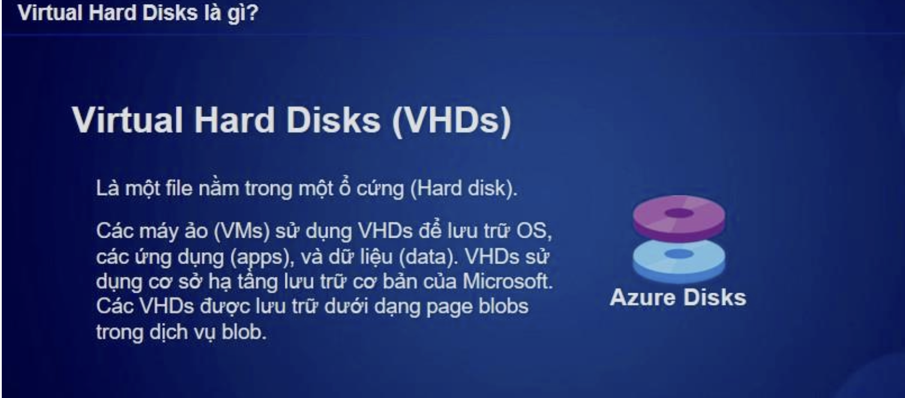
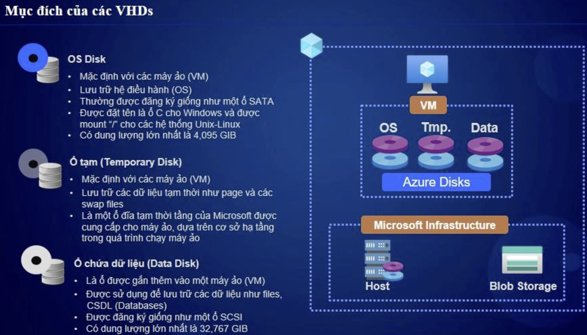
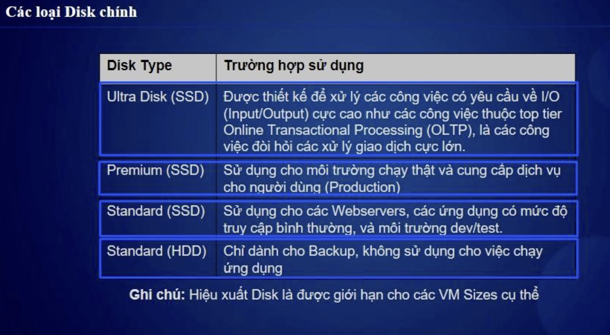

# 🖥️ Quản Lý Disk Trong Azure VM  

## 1️⃣ Tổng Quan Về Azure VM Disks  
Azure cung cấp nhiều loại đĩa lưu trữ để tối ưu hóa hiệu suất và chi phí khi chạy máy ảo.   
VHDS (Virtual Hard Disks): Ổ Ảo sử dụng hạ tầng lưu trữ dưới dạng page blobs trong dịch vụ blob

Mục đích disk để lưu trữ và tổ chức các loại lưu trữ

✅ **Disk được quản lý (Managed Disks)**: Azure quản lý tự động  
✅ **Disk không được quản lý (Unmanaged Disks)**: Cần tự quản lý  
✅ **Hỗ trợ nhiều loại Storage: HDD, SSD, Ultra Disk**  

---

## 2️⃣ Các Thành Phần Chính Của Azure VM Disk  


| **Thành phần** | **Mô tả** |
|--------------|----------|
| **OS Disk** | Chứa hệ điều hành của VM |
| **Data Disk** | Dùng để lưu dữ liệu & ứng dụng |
| **Temporary Disk** | Ổ đĩa tạm, bị xóa khi restart VM |
| **Ephemeral OS Disk** | OS chạy trên local SSD, không tốn phí lưu trữ |
| **Snapshots** | Chụp nhanh trạng thái của disk |
| **Disk Encryption** | Mã hóa dữ liệu để bảo mật |

---

## 3️⃣ Các Loại Managed Disks  


| **Loại Disk** | **Mô tả** | **Sử dụng phổ biến** |
|--------------|----------|----------------|
| **Standard HDD** | Giá rẻ, hiệu suất thấp | Test, Development |
| **Standard SSD** | Giá tốt hơn, tốc độ nhanh hơn HDD | Web server nhỏ, ứng dụng không yêu cầu cao |
| **Premium SSD** | Hiệu suất cao, IOPS tốt | Database, Web App lớn |
| **Ultra SSD** | Latency thấp, IOPS cực cao | Big Data, AI/ML, SAP HANA |

📌 **IOPS & Throughput cao hơn sẽ giúp tăng tốc độ đọc/ghi dữ liệu!**  

---

## 4️⃣ Các Tác Vụ Quản Lý Disk  

### 📌 **Thêm Data Disk vào VM**  
```bash
az vm disk attach --resource-group myResourceGroup \
  --vm-name myVM --name myDataDisk --size-gb 128
```

## 5️⃣ High Availability & Backup Cho Disk
| **Tính năng** | **Mô tả** |
|--------------|----------|
|Azure Backup|	Tự động backup disk theo lịch trình|
|Snapshot|	Lưu trạng thái disk để phục hồi nhanh|
|Zone Redundant Storage (ZRS)|	Đảm bảo disk luôn có sẵn ở nhiều zone|
|Azure Site Recovery (ASR)	|DR solution, giúp phục hồi dữ liệu khi có sự cố|
