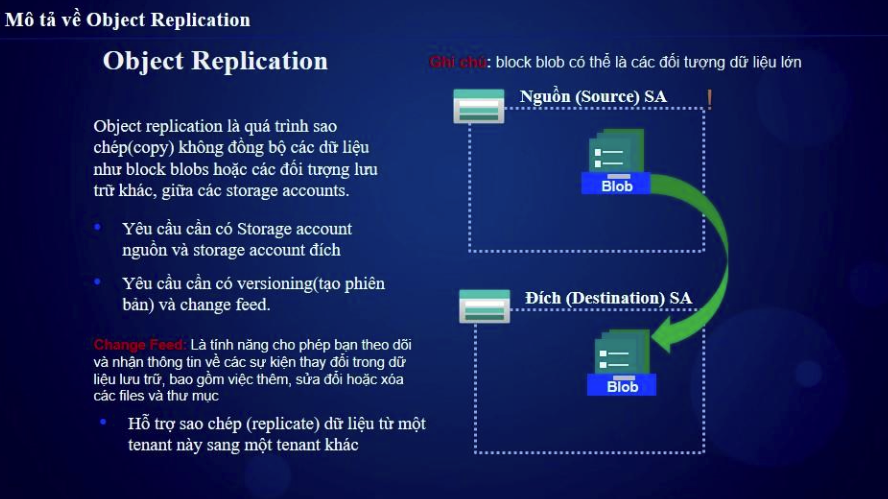
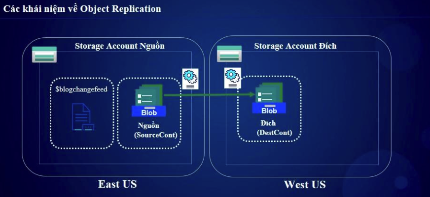

# 🔄 Azure Blob Object Replication  

## 1️⃣ Blob Object Replication Là Gì?  
**Blob Object Replication** cho phép tự động **sao chép (replicate) dữ liệu blob** từ một **Storage Account nguồn** sang một **Storage Account đích** trong cùng hoặc khác vùng (region).  

📌 **Lợi ích:**  
✅ Cải thiện hiệu suất truy xuất dữ liệu gần với người dùng hơn  
✅ Đảm bảo tính sẵn sàng & dự phòng dữ liệu giữa các vùng  
✅ Hỗ trợ **rule-based replication**, chỉ sao chép blobs theo điều kiện đặt trước  
✅ Không thay đổi URL của Blob khi sao chép  

---

## 2️⃣ Kiến Trúc Hoạt Động  

💡 **Blob Object Replication hoạt động dựa trên "Replication Policies"**, gồm:  
- **Source Storage Account**: Nơi chứa blob gốc cần sao chép  
- **Destination Storage Account**: Đích đến nhận dữ liệu sao chép  
- **Replication Rules**: Quy định **container nguồn** và **container đích**, có thể lọc blob dựa trên tag  

📌 **Lưu ý:**  
- Chỉ hỗ trợ trên **Block Blob**  
- Cả 2 Storage Accounts phải là **General Purpose v2 (GPv2) hoặc Blob Storage**  
- Storage Accounts phải bật **versioning (phiên bản blob)**  

---

## 3️⃣ Cấu Hình Blob Object Replication  
- Tạo 2 storage account (1 cái source , 1 cái destination)
- Truy cập Data protection enable versioning & Enanble blob change feed, Ở storage account destination chỉ cần bật versioning thôi


### 🛠️ **Bước 1: Bật Versioning Cho Cả Hai Storage Accounts**  
```bash
az storage account blob-service-properties update \
  --account-name mystorageaccountsource \
  --enable-versioning true
```

### 🛠️ ** Bước 2: Tạo Policy Sao Chép Blob**  
```bash
az storage account or-policy create \
  --account-name mystorageaccountsource \
  --destination-account mystorageaccountdestination \
  --rules '[{"sourceContainer": "source-container", "destinationContainer": "destination-container"}]'
```

📌 Sử dụng Azure Portal:

1. Vào Azure Portal → Storage Account nguồn → Data Management → Object Replication
2. Chọn "Add Replication Policy"
3. Chọn Storage Account đích và Container
4. Thiết lập Replication Rule, nhấn Save
