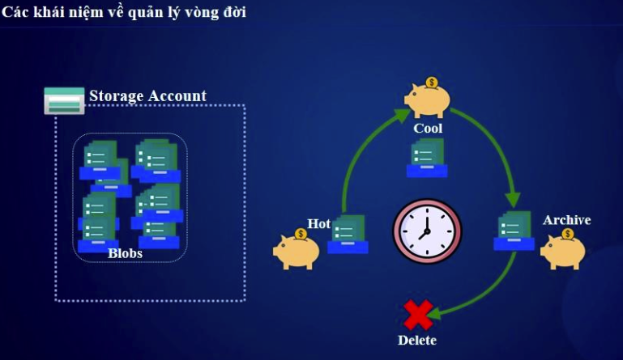

# 🔄 Vòng Đời Của Blob Storage  

## 1️⃣ Giới Thiệu  
**Vòng đời của Blob Storage** (Blob Lifecycle Management) cho phép tự động **di chuyển, xóa, hoặc thay đổi cấp lưu trữ (tiers)** của Blob dựa trên các quy tắc (lifecycle rules).  
Mục tiêu là tối ưu **chi phí** và **hiệu suất**, đặc biệt với dữ liệu ít được truy cập.  



---

## 2️⃣ Các Trạng Thái Trong Vòng Đời Của Blob  

| **Giai Đoạn** | **Mô Tả** | **Chi phí** |
|--------------|----------|------------|
| **Tạo Blob** | Blob được tạo và lưu trữ trong **Hot** hoặc **Cool Tier** | Cao (Hot), Trung bình (Cool) |
| **Chuyển sang Cool Tier** | Khi Blob không được truy cập thường xuyên (30 ngày hoặc hơn) | Trung bình |
| **Chuyển sang Archive Tier** | Dữ liệu rất ít khi truy cập (lưu trữ dài hạn, >180 ngày) | Thấp |
| **Xóa Blob** | Khi dữ liệu không còn cần thiết, có thể thiết lập **tự động xóa** | Không tốn chi phí |

📌 **Lưu ý:**  
- **Hot → Cool → Archive**: Di chuyển giữa các tier để tiết kiệm chi phí.  
- **Archive → Hot**: Tốn nhiều thời gian để truy xuất lại dữ liệu (~ vài giờ).  
- **Có thể thiết lập tự động chuyển đổi bằng Lifecycle Management Rules.**  

---

## 3️⃣ Thiết Lập Quy Tắc Vòng Đời (Lifecycle Management)  

### 🔹 Bước 1: Tạo Quy Tắc Lifecycle Trong Azure Portal  
1. Vào **Azure Portal → Storage Account → Data Management → Lifecycle Management**  
2. Nhấn **"Add a rule"**  
3. Chọn **Container/Blob áp dụng**  
4. Định nghĩa hành động:  
   - **Move to Cool storage** sau X ngày  
   - **Move to Archive storage** sau Y ngày  
   - **Delete blob** sau Z ngày  
5. Nhấn **Save** để kích hoạt quy tắc  

---

### 🔹 Bước 2: Cấu Hình Lifecycle Policy Bằng Azure CLI  
📌 **Tạo policy tự động di chuyển Blob sang Archive Tier sau 180 ngày và xóa sau 365 ngày:**  
```bash
az storage account management-policy create \
  --account-name mystorageaccount \
  --policy '{
      "rules": [{
          "enabled": true,
          "name": "MoveToArchiveAndDelete",
          "type": "Lifecycle",
          "definition": {
              "filters": {
                  "blobTypes": ["blockBlob"]
              },
              "actions": {
                  "baseBlob": {
                      "tierToArchive": { "daysAfterModificationGreaterThan": 180 },
                      "delete": { "daysAfterModificationGreaterThan": 365 }
                  }
              }
          }
      }]
  }'
```
### 🔹 Bước 3: Kiểm Tra & Cập Nhật Quy Tắc
📌 Kiểm tra các quy tắc hiện có:

``` bash

az storage account management-policy show --account-name mystorageaccount
```
📌 Cập nhật chính sách vòng đời:

bash
```sh
az storage account management-policy update \
  --account-name mystorageaccount --set rules[0].enabled=false
  ```